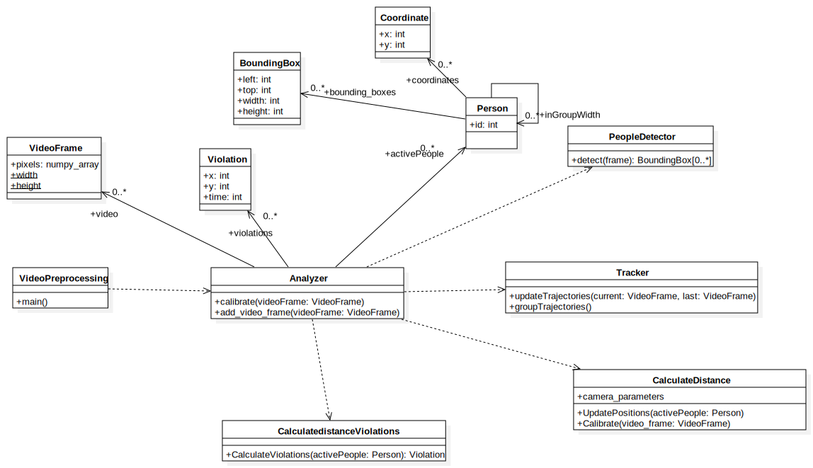

# social-distancing-net

### requirements
pre-trained model: https://drive.google.com/file/d/12oWMkaDhoNt-EhOYjNnhGMoMpYw53PlA/view?usp=sharing
#### YOLO
python 3.7.3 (3.6 is jó sztem)

numpy 1.17.3

matplotlib 3.1.1 (csak a részeredmények plotolásához egyenlőre)

cv2 4.1.0

tensorflow 2.2 (esetleg tf-GPU 2.1)

keras 2.2.4

[Trello](https://trello.com/b/hxlqbCye/socialdistancingnet)

## Classdiagram

